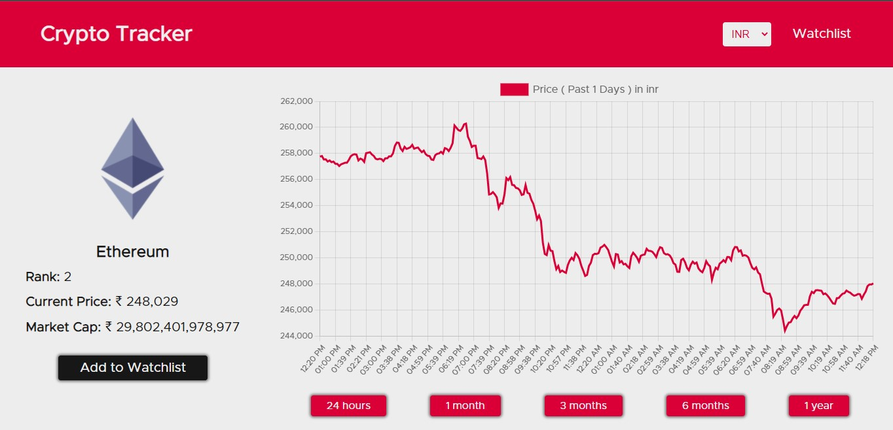

# Cryptocurrency Tracker App

This is a crypto tracker app made using Reactjs. The charts in the app are created using Chartjs. The API used for data regarding cryptocurrency is Coin Gecko Api.

## Built with

- Reactjs
- Chartjs

## Features

- Homepage

- Info Page

This page contains information regarding crypto and various charts regarding historical prices of crypto.

- Watchlist

Watchlist to keep track of your favourite crypto.

